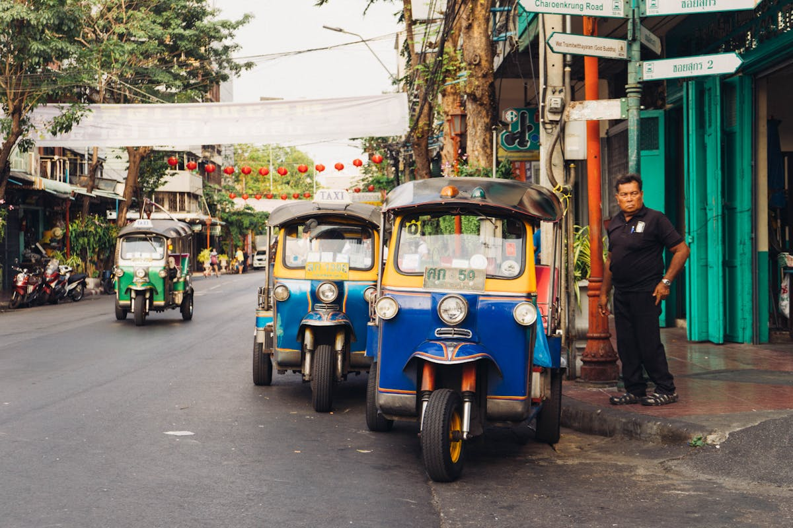

## Info Pratiche — Bangkok

### Come Arrivare

**Volo Siem Reap → Bangkok** (Giorno 25)

I voli da Siem Reap a Bangkok partono da circa $122 per tratta singola con compagnie low-cost come Thai AirAsia, mentre i voli andata e ritorno oscillano tra $218-222
. Il prezzo di ~50€ del vostro itinerario è molto realistico se prenotate con anticipo.

**Compagnie consigliate:**
- **Thai AirAsia**: 
offre le tariffe più economiche, con voli da $122 per tratta singola

- **Bangkok Airways**: 
voli da $226 andata e ritorno
, più confortevoli ma costosi
- **Thai Airways**: 
servizio premium
 ma prezzi più elevati

**Dove prenotare:**
- [Thai AirAsia](https://www.airasia.com/)
- [Google Flights](https://flights.google.com/) per confrontare prezzi
- [Momondo](https://www.momondo.com/flights/siem-reap/bangkok) per le migliori offerte

**Pro tip:** 
I voli più economici sono solitamente a giugno, con prezzi che oscillano tra $155-180
, ma anche settembre-ottobre offrono buone tariffe se prenotate 2-3 mesi prima.

### Come Muoversi

**BTS Skytrain & MRT** (Il più pratico)

I biglietti BTS costano 16-59 baht (circa 0,45-1,65€) a seconda della distanza, mentre la Airport Rail Link da Suvarnabhumi costa 45 baht
. 
Il pass giornaliero BTS costa 150 THB (circa 4,20€)
, conveniente se fate più di 3-4 viaggi al giorno.

**Carte ricaricabili:**
- **Rabbit Card**: 
costa 200 baht (100 baht deposito rimborsabile + 100 baht di credito), valida 5 anni e funziona su tutte le linee BTS

- Comprabile alle stazioni o [online](https://www.rabbit.co.th/)

**Grab (App taxi — raccomandatissimo)**

Un viaggio standard Grab nel centro di Bangkok costa 100-250 THB (2,8-7€) in condizioni normali, mentre viaggi brevi di 2-3 km partono da 60-80 THB
. 
Attenzione al surge pricing: nelle ore di punta (17-19) o con pioggia i prezzi possono salire del 50-200%
.

**Costi medi:**
- Corsa breve centro città: 60-120 THB (1,7-3,4€)
- 
Aeroporto → centro: 650-900 THB (18-25€)

- 
Grab Bike (moto): 30-50 THB per distanze brevi, più veloce nel traffico

**Tuk-tuk** (Per l'esperienza)

I prezzi a Bangkok variano da 100-200 baht per viaggi brevi
, ma 
spesso i conducenti quotano 150-300 THB per percorsi che costerebbero 60 THB con Grab. È più un'esperienza turistica che trasporto pratico
.

**App utili:**
- **Grab** (indispensabile)
- **Citymapper** per trasporto pubblico
- **ViaBus** per autobus pubblici

### Dove Dormire

**Budget: 35€/notte per camera doppia**

**1. The Moment Bangkok** ⭐⭐⭐⭐
- **Zona**: Old Town
- **Prezzo**: ~35-40€/notte
- 
Hotel moderno con piscina, palestra e design elegante, "super pulito e molto ben progettato, bella piccola piscina, palestra buona e molto pulita"

- [Prenota su Booking.com](https://www.booking.com/hotel/th/the-moment-bangkok.html)

**2. Casa Luna** ⭐⭐⭐
- **Zona**: Siam (centralissimo)
- 
A 1,5 km da Siam Discovery e MBK, staff eccezionale: "Pong era molto utile e attento, ha risolto un problema di lavanderia e ha fornito un ottimo itinerario per Bangkok"

- **Prezzo**: 30-35€/notte
- [Prenota su Booking.com](https://www.booking.com/hotel/th/casa-luna.html)

**3. Ayathorn Bangkok** ⭐⭐⭐⭐
- **Zona**: Old Town (vicino a Wat Saket)
- 
Hotel con palestra, parcheggio gratuito, giardino e terrazza

- **Prezzo**: 32-38€/notte
- [Prenota su Booking.com](https://www.booking.com/hotel/th/ayathorn-bangkok.html)

**4. Hotel Thomas** ⭐⭐⭐
- **Zona**: Phaya Thai (2 min a piedi dalla stazione BTS)
- 
Hotel budget-friendly vicino alla stazione BTS Phaya Thai, 229 camere doppie (27-32m²), possibilità di letto extra per 3 persone

- **Prezzo**: 28-35€/notte
- [Prenota su Booking.com](https://www.booking.com/hotel/th/thomas-bangkok.html)

**Pro tip:** 
I migliori hotel budget a Bangkok offrono camere private pulite, aria condizionata, WiFi gratuito e accesso conveniente alle stazioni BTS o MRT, tipicamente tra $30-70 a notte
. Zone popolari per soggiorni economici includono Sukhumvit, Silom, Siam e la Città Vecchia.

### Connettività e SIM

**Migliori operatori:**

**AIS**: raccomandata come migliore SIM all'aeroporto di Bangkok, eccellente rete senza restrizioni di velocità per le SIM turistiche

**True-DTAC**: tecnicamente due operatori diversi ma appartengono alla stessa azienda dopo la fusione

**Dove comprare:**

Negozi ufficiali AIS, True e DTAC nella hall arrivi dell'aeroporto Suvarnabhumi (BKK) e Don Mueang (DMK), aperti 24 ore

**Prezzi SIM turistiche all'aeroporto 2026:**

- **8 giorni**: 15 GB + internet illimitato a 4 Mbps = 399 THB (~13€)
- **15 giorni**: internet illimitato a 4 Mbps = 699 THB (~22€) 
- **30 giorni**: internet illimitato a 10 Mbps = 999 THB (~32€)

**eSIM alternativa:**

**DTAC Happy Tourist eSIM** tramite SimOptions: installabile prima del viaggio, connessione istantanea all'arrivo, dati illimitati da ~$10

**Registrazione:**

Tutte le SIM richiedono registrazione con passaporto per legge tailandese. All'aeroporto il personale gestisce tutto: copia passaporto, registrazione sistema e attivazione in pochi minuti

**WiFi pubblico:** Disponibile negli hotel, centri commerciali e stazioni BTS/MRT. 
Airport free WiFi disponibile per chiamare Grab se le code per SIM sono lunghe
.

### Sicurezza

**Truffe comuni da evitare:**
- **Taxi senza tassametro**: 
I taxi hanno guadagnato reputazione per non usare il tassametro, ma la maggior parte dei conducenti accetta corse a tassametro che costano almeno il 50% in meno dei prezzi fissi

- **Tuk-tuk gonfiati**: 
Sono più costosi di Grab, sempre contrattare e chiarire il prezzo con il conducente per evitare truffe

- **Guide non ufficiali**: Evitare "guide" che si avvicinano per strada

**Aree sicure:**
- Tutte le zone turistiche principali (Siam, Silom, Sukhumvit)
- 
Non c'è nulla di intrinsecamente pericoloso negli ostelli e alloggi economici nel sudest asiatico (diversamente da molte città occidentali dove alloggio economico = zona malfamata)

**Numeri di emergenza:**
- **Polizia turistica**: 1155
- **Emergenza generale**: 191
- **Ambulanza**: 1669
- **Vigili del fuoco**: 199

**Consigli di sicurezza:**
- Usare sempre Grab invece di taxi di strada nelle zone turistiche
- 
Non è possibile prenotare taxi nelle aree riservate o luoghi con problemi di sicurezza, anche con app. Per sicurezza, usare taxi da aree affollate o punti di prelievo designati

- Evitare di mostrare oggetti di valore in aree affollate
- 
Usare VPN per sicurezza su WiFi pubblico e per aggirare alcune censure internet in Tailandia

**Quartieri raccomandati per alloggio:**
- **Siam/Sukhumvit**: Centrali, sicuri, ben collegati
- **Silom**: Business district, sicuro di notte
- **Old Town/Banglamphu**: 
Buono per giovani viaggiatori, vicino ai siti turistici, cibo economico, ma non necessario stare proprio su Khao San Road

---

### Galleria Fotografica

*Foto di Martin Péchy su Pexels*

